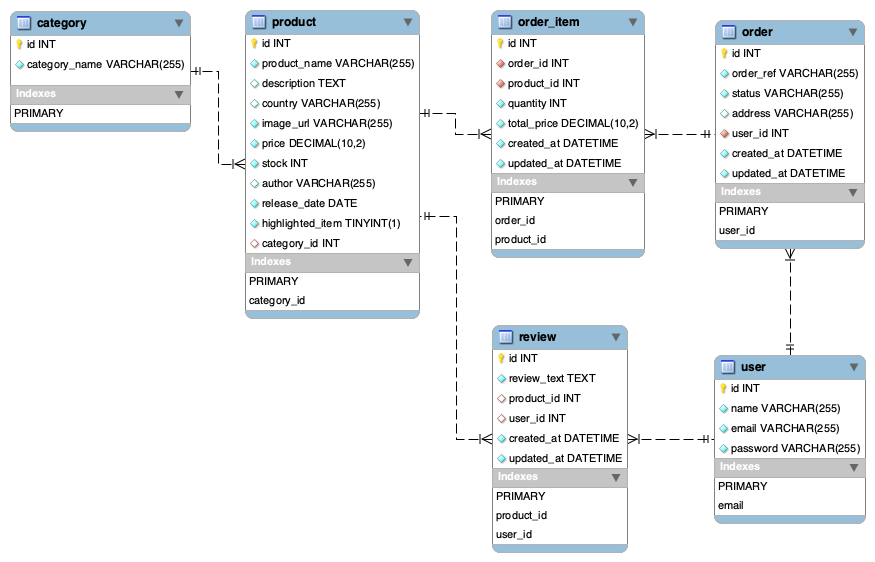

# Online Comic Store

## Table of Contents
* [Description](#description)
* [User Story](#user-story)
* [Acceptance Criteria](#acceptance-criteria)
* [Database Schema](#database-schema)
* [Screenshot](#screenshot)
* [Installation](#installation)
* [Features](#features)
* [Live URL](#live-url)
* [Contributors](#contributors)
* [Testing](#testing)
* [Questions](#questions)
* [License](#license)

## Description
The online comic store app for Comic World has been designed and built using the MVC paradigm, where we have created our own server-side API, added user authentication and connected to a database.

## User Story
AS a comic lover, 
I WANT to access a fancy online comics store 
SO THAT I can browse and purchase my favorite comics. 

## Acceptance Criteria
GIVEN a Online Comics Store 
WHEN I visit the site for the first time 
THEN I am presented with the homepage, which includes a list of comic books available in the database. On the top of the page, there are navigation links for the homepage,  the checkout; and the option to log in and logout  
WHEN I click on the homepage option 
THEN I am taken to the homepage 
WHEN I click on any item of comic book, 
THEN I am presented with a page containing the details of the comic book.  For each comic book item, there is a “ADD TO CART” button. 
WHEN I click the “Login” on the navigation links 
THEN I am presented with a login page with email and password textbox for input 
WHEN I input the email and password and click the “Submit” button in login page 
THEN I am able to login to the online comics store site 
WHEN I click the “SIGN UP” button in the “Log in” page 
THEN I am presented with a signup page with email and password textbox for input 
WHEN I input the email and password and click the “SIGN UP” button in sign up page 
THEN an account is created in the database and I am able to login to the online comics store site 
WHEN I am logged on and viewing the comic book item 
THEN we can add comments for that comic book item.  
WHEN I am logged on and click the “ADD TO CART” button on the comic book item,  
THEN that comic book item is added to the checkout page. 
WHEN I click the “Checkout” on the navigation links 
THEN I am presented with the checkout page listing the comic items we added to the cart.  
WHEN I click the “CONFIRM ORDER” button on checkout page 
THEN a confirmation email with the order details is sent to my mailbox. 

## Database Schema

## Screenshot

## Installation

1. To setup the application in local, run "npm i" to install the below packages. 
    * bcryptjs
    * connect-session-sequelize
    * dotenv
    * express
    * express-handlebars
    * express-session
    * mysql2
    * nodemailer
    * sequelize

2. Under the repository folder, open the terminal and login mySQL CLI.  Execute script by issuing command "source db/schema.sql" to create the database. 

3. Quit the mySQL CLI, run "npm start" to load the model to the database. 

4. run the script "source db/seeds.sql" in mySQL CLI to load the sample data to the database. 

## Features
* Uses Node.js and Express.js to create a RESTful API.
* Uses Handlebars.js as the template engine.
* Uses MySQL and the Sequelize ORM for the database.
* Has both GET and POST routes for retrieving and adding new data.
* Uses a new module Nodemailer to facilitate the sending of order confirmation emails to customers.
* Has a folder structure that meets the MVC paradigm.
* Includes authentication (express-session and cookies).
* Protects API keys and sensitive information with environment variables.
* Is deployed using Heroku (with data).
* Has a polished UI.
* Is responsive.
* Is interactive (in other words, accepts and responds to user input).
* Meets good-quality coding standards (file structure, naming conventions, follows best practices for class/id naming conventions, indentation, quality comments).

## Live URL 
https://comic-world-125.herokuapp.com/

## Contributors
* GitHub: [chengpitchi](https://github.com/chengpitchi)
* GitHub: [NebsterOne](https://github.com/NebsterOne)
* GitHub: [CheBar1](https://github.com/CheBar1)

## Testing
> APIs were tested using Insomnia: https://insomnia.rest/ 

> Application is tested by manual test scripts through the Chrome browser.  

## Questions
Please send your questions [here](mailto:findme@gmail.com?subject=[GitHub]%20Dev%20Connect) or visit [github/chengpitchi](https://github.com/chengpitchi).

## License
MIT